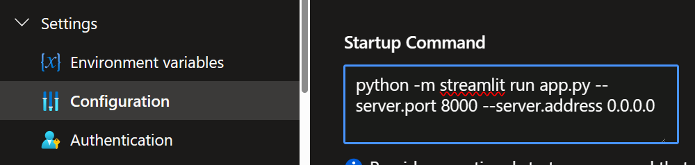

# Task Management Demo

In questo progetto è presente un esempio di gestione di task in due parti:
- **Backend**: realizzato con Azure Functions e SQL Server (cartella `taskfunctions`)
- **Frontend**: realizzato con Web App in Python e Streamlit (cartella `taskapp`)

## Note

- Sono stati creati due venv separati. Per installare le dipendenze basta esequire `pip install -r requirements.txt` nelle rispettive cartelle `taskfunctions` e `taskapp` oppure usare le funzionalità di Visual Studio Code.

- Per il backend è necessario creare un database SQL Server e configurare la stringa di connessione in `local.settings.json` (non presente in questa repository perché bloccato dal file `.gitignore` e per non condividere le chiavi di accesso).

- Per il frontend è necessario configurare le stringhe di connessione in un nuovo file `.env` (non presente in questa repository perché bloccato dal file `.gitignore` e per non condividere le chiavi di accesso).

- Per il frontend, ho pure aggiunto un file launch.json per il debug in Visual Studio Code.

In Azure, è necessario configurare la web app per eseguire correttamente streamlit al lancio. Per fare ciò, è necessario aggiungere il seguente comando in `Startup Command`:
```bash
python -m streamlit run app.py --server.port 8000 --server.address 0.0.0.0
```



Oltre a questo, è necessario configurare le variabili d'ambiente con le stringhe di connessione al database SQL Server (per la Function App) e le stringhe di connessione alla Function App (per la Web App).