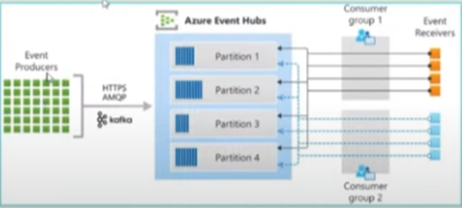
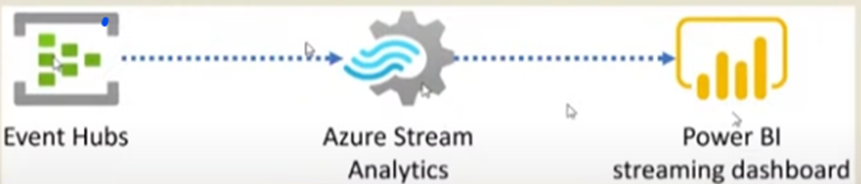
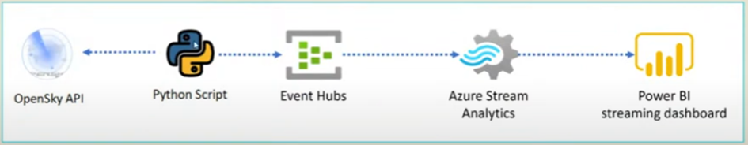
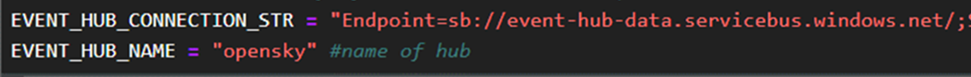
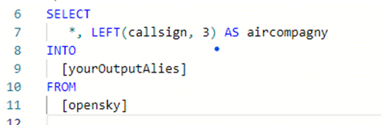

# STREAMING AND ANALYZING REAL DATA WITH DATA AZURE

## ABOUT THE PROJECT

Resources to use:

* **Event Hub:** keeps the data for 1 day
* **Azure stream analytics:** This is a resource that is used to process data on real-time data. You can make SQL-like queries on it to process the data in real time.

* **Data producers**: a python script that will retrieve data from an API for example to push it to Stream analytics which will play the role of **the consumer** to analyze this data in real time

From the Event hub, we will configure tokens to link python to our event hub, "Shared access policies".

**Data source:**

We will retrieve data from **OpenSky** ([The OpenSky Network - Free ADS-B and Mode S data for Research](https://opensky-network.org/)), which provides an open-source API that gives information about flights in real time.

## ARCHITECTURE

**The first python script** will retrieve the data **from the API** and **a second python script** will connect to our **event hub** and send the retrieved data at regular intervals. This data will then be analyzed, processed via **Azure stream Analytics**, and visualized **on Power BI.**

## PROJECT IMPLEMENTATION STEPS

Create a Python script (open_sky.py) to retrieve the data from the API

Modules:

* requests (to make requests with Python)

Create a Python script to act like a Producer (send.py) to send the data to Event Hub
Modules:

* Azure.eventhub
* requests
* the OpenSky API module (optional)

NOTE: You have to clone the API module from its git repository.

1. Place yourself in the folder where your python files are located.
2. Clone the repository:
   `git clone https://github.com/openskynetwork/opensky-api.git`
3. Navigate to the cloned directory:
   `cd opensky-api/python`

### Configuring Event HUB

1. Add an Event hub (opensky). If we had more Event hubs, this would allow us to separate each hub by purpose and scope.
2. Connecting with python is done with Shared Access Policies: RootManageSharedAccessKey

> The key you retrieve from RootManageSharedAccessKey
>
> The name of your hub

**Microsoft link to understand synchronization:** [azure.eventhub.aio.EventHubProducerClient class | Microsoft Learn](https://learn.microsoft.com/en-us/python/api/azure-eventhub/azure.eventhub.aio.eventhubproducerclient?view=azure-python#azure-eventhub-aio-eventhubproducerclient-send-batch)

The role of the producer (send.py) is to send data at regular time intervals to the event hub.

So once the configuration is complete: go to the command prompt to run in your source directory: `python send.py 10 1` (duration, frequency)

So that means that we run it for 10min with a frequency of 1 min per run.

1. Setting up the Stream Analytics job

**Stream analysis** is used for the transformation and processing of data **in real time. It will therefore consume the data** from **eventhub** and apply a transformation.

The important components of the **Analytics stream are:**

* 1. **Input (eventhub,...)**\
     Go to Task Topology: Inputs\
     *For the Analytics stream* we don't need keys (tokens) to connect the services.
  2. **The Query part**\
     To visualize our data from our eventhub, we must process the records before viewing in Power BI.\
     
  3. OUTPUT: where will our data be sent (Power BI,...)\
  Save your output in the format you want.\
Save your queries, then go to Overview. Start the job to analyze the data in real time.
